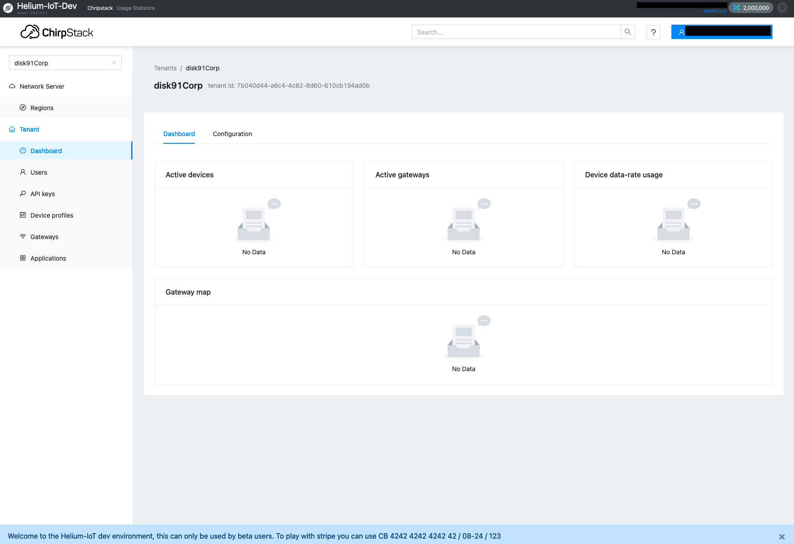

# Helium / Chirpstack integration



- Follow progress and roadmap on the [project board](https://github.com/users/disk91/projects/1/views/1)
- Public console running the software [console.helium-iot.xyz](https://console.helium-iot.xyz)

### Version
**Do not use the master version in production, they are in-progress not tested at scale versions, please use the Released Versions**

### Chirpstack support
- Chirpstack 4.7.0
- Never change the Chirpstack version, this project is specific for a given Chirpstack version, wait for project update before upgrading Chirpstack.


### Features (development in progress)

- Manage fully configurable billing capabilities for helium
    - cost per uplink
    - cost per duplicates
    - cost per downlink
    - cost per device creation
    - cost per period of activity
    - cost per period of inactivity
    - cost pers DCs / minimum DCs volume purchasing
    - limit device DCs consumption on a given period of time
    - Limit device DCs consumption overall
    - upfront billing
    - end of month billing
- Allows public signup (or not)
- Ability to limit the number of device and tenant
- Manage the device declaration / deactivation on helium router
- Manage multi-tenant chirpstack environment
- Manage stripe payments to get DCs
- Manage DC transfer between payments
- Manage Service Request between customer and admin
- Manage Communication to users
- Manage Invoice generation
- Manage device migration from console
- Manage device live migration from console
- Manage device live Region change
- Manage Helium integration with forwarder

## Build the application

Installation is automated with a script and take under 5 minutes for a standard configuration.

As a pre-requisite:
- You need to have Ubuntu 22.x server ready (config 4VCPU / 8GB / 40GB or more)
- You need to have a domain name pointing to your server for https configuration or a public IP for http configuration.
- You need to have SMTP (service to send email) setup ready, if your don't master this, register on sendgrid, configure your email
and create an API key. 

Once you completed the pre-requisite, you can run setup script
```
bash ./makeiteasy.sh
```

For advanced user & usage, I recommend to follow the full installation guide including the Chirpstack configuration is detailed on (disk91.com blogpost)[https://www.disk91.com/2022/technology/helium/installing-chirpstack-lorawan-network-server-for-helium/]

### Debugging

In most of the cases, problems come from mis-settings during the configuration phase.
Some tips to help in debugging:

`docker ps` list the running services, if some are restarting on every 30 seconds, look at the service logs to identify the problem. `docker logs` *service_name* will show you the details.

`docker logs helium-helium-1 | grep -i error` also helps to identify the reason why the companion refuses to start or starts with some feature deactivated due to setting issues.

## Monitoring

The solution comes with `grafana` dashboard pre-configured and server / docker monitoring. `grafana` is not exposed publicly and
it can be accessed over a ssh tunnel or locally on port 8050. Default user / password is admin/admin.

## Stop the application
- clean exist with cache purge and queueing processes
 `curl -fX GET http://127.0.0.1:8090/internal/3.0/exit`
- send SIGTERM message to the process (sent when docker stop)


## License
This program is distributed according to [GPLv3](https://www.gnu.org/licenses/gpl-3.0.en.html) licence for any private 
IoT device fleet purpose, without restriction.

Specific licences can be obtained by contacting the Author. Any reuse of this code-source needs to be indicated and modifications/addition need to 
be publicly published, even when small pieces of code or architecture are reused as requested by GPLv3.

## Credits
Thank you to the following persons contributing to the project:
- [DeflateAwning](https://github.com/DeflateAwning) for fixing grammar and improving english translations.


## Misc for developers
- Nova service GRPC proto can be found on - https://github.com/helium/proto/blob/master/src/service/iot_config.proto
- Protoc - version used 25.1 - https://github.com/protocolbuffers/protobuf
- Stub pluggin - https://github.com/grpc/grpc-java/releases
- Download Stub pluggin - https://repo.maven.apache.org/maven2/io/grpc/protoc-gen-grpc-java/1.60.1/
- Command lines
```agsl
./protoc/bin/protoc --plugin=protoc-gen-grpc-java=.../protoc-gen-grpc-java-1.60.1-osx-x86_64.exe --java_out=... \
                    --grpc-java_out=...same... --proto_path=.../proto/src/ service/iot_config.proto
./protoc/bin/protoc --java_out=... --proto_path=.../proto/src/ region.proto
./protoc/bin/protoc --java_out=... --proto_path=.../proto/src/ blockchain_region_param_v1.proto
```

- Chirpstack-api grpc api found on - https://github.com/brocaar/chirpstack-api/tree/master
- gooogleapi found on - https://fuchsia.googlesource.com/third_party/googleapis
- Chirpstack grpc api found on - https://github.com/chirpstack/chirpstack.git
```bash
# for chirpstack grpc api
~ git checkout v4.7.0
```

Add following headers in file `chirpstack/api/proto/internal/internal.proto`
```proto
option java_package = "io.chirpstack.internal";
option java_multiple_files = true;
option java_outer_classname = "InternalProto";
```

````
./protoc/bin/protoc -I ./chirpstack/api/proto -I ./googleapis/ --java_out ./out ./chirpstack/api/proto/common/common.proto
./protoc/bin/protoc -I ./chirpstack/api/proto -I ./googleapis/ --java_out ./out ./chirpstack/api/proto/api/user.proto 
./protoc/bin/protoc -I ./chirpstack/api/proto -I ./googleapis/ --java_out ./out ./chirpstack/api/proto/api/device.proto
./protoc/bin/protoc -I ./chirpstack/api/proto -I ./googleapis/ --java_out ./out ./chirpstack/api/proto/api/internal.proto
./protoc/bin/protoc -I ./chirpstack/api/proto -I ./googleapis/ --java_out ./out ./chirpstack/api/proto/api/tenant.proto
./protoc/bin/protoc -I ./chirpstack/api/proto -I ./googleapis/ --java_out ./out ./chirpstack/api/proto/internal/internal.proto

./protoc/bin/protoc -I ./chirpstack/api/proto -I ./googleapis/ --java_out ./out ./chirpstack/api/proto/stream/api_request.proto
./protoc/bin/protoc -I ./chirpstack/api/proto -I ./googleapis/ --java_out ./out ./chirpstack/api/proto/stream/frame.proto
./protoc/bin/protoc -I ./chirpstack/api/proto -I ./googleapis/ --java_out ./out ./chirpstack/api/proto/gw/gw.proto
````

Install OpenJDK21
```
apt-get install openjdk-21-jdk
update-java-alternatives --set /usr/lib/jvm/java-1.21.0-openjdk-amd64
```